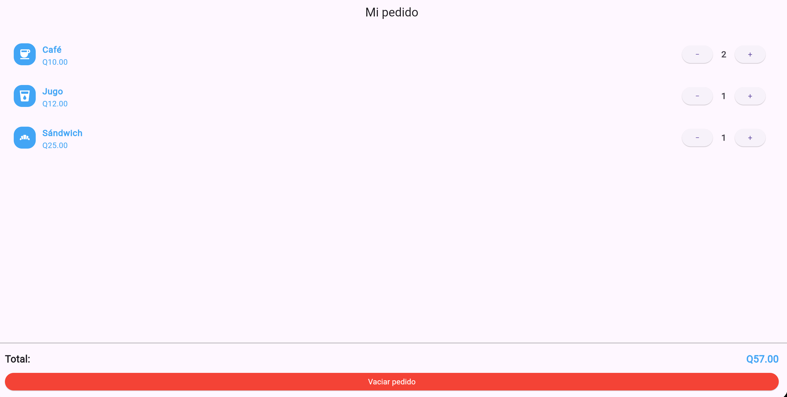

# cafeteria

Laboratorio para reutilizar widgets enfocado en un menu de cafeteria 

Como calculo el total ? 
Sumo el resultado de multiplicar la cantidad de registrada de cada producto con el valor del producto. 
Por que conviene reutilizar  ProductoPedido? Porque ya no hay que codificar cada producto, solo se llenan sus datos al seguir todos el mismo formato.