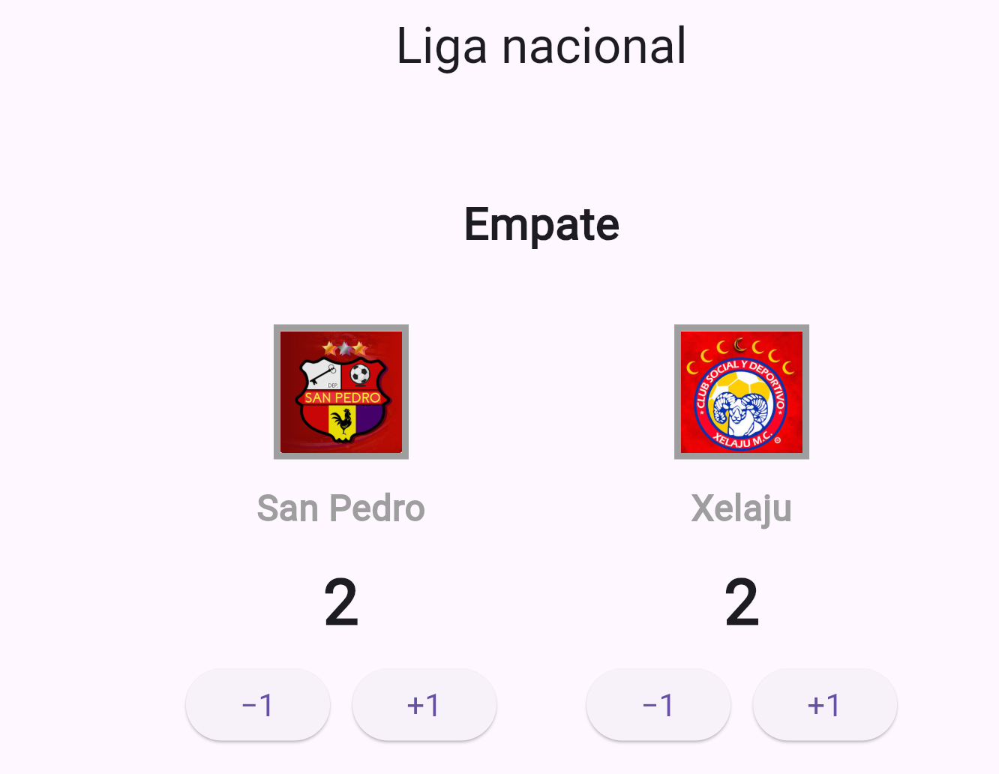
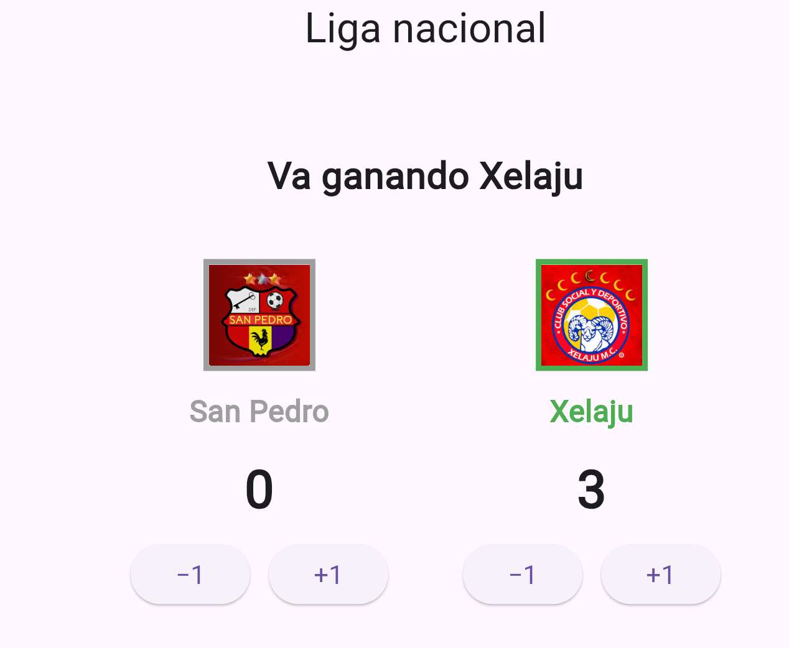

# Marcador Deportivo

Aplicación Flutter que implementa un marcador interactivo para practicar composición de interfaces, estado local y actualización reactiva de la UI.

## Capturas de pantalla

### Empate

### Equipo ganando

## Explicación: setState

**¿Qué hace `setState` cuando presiona un botón?**

`setState()` le informa al framework de Flutter que el estado interno del widget ha cambiado y que podría afectar la interfaz. El framework planifica una reconstrucción del widget para reflejar los cambios en la UI.

**¿Qué ocurriría si cambia los puntos sin llamarlo?**

Si no se llama a `setState()`, los datos cambiarían internamente pero la interfaz nunca se actualizaría. El usuario vería los mismos valores en pantalla, incluso aunque los puntos hayan cambiado en el código.